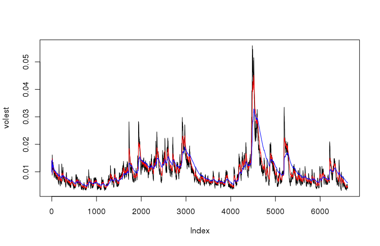

[GitHub Link](https://github.com/gmichel-SMU/W11-MSDS/)

```{r setup, include=FALSE}

knitr::opts_chunk$set(echo = TRUE, eval = FALSE)

```

## R Markdown to illustrate S&P500 analysis

## Uncomment and install packages if you don't have it
#install.packages("tseries")

```{r}

library(tseries)
library(caTools)
library(httpuv)


```


##  Getting S&P 500 (^GSPC) data.
##  SNP - SNP Real Time Price. Currency in USD

## Download the data of SP500 '^gspc'.
```{r }

SNPdata <- get.hist.quote('^gspc',quote="Close")

```
## Calculate the log returns, which is the subtractration of log(lag(SNPdata)) and log(SNPdata)
```{r }

SNPret <- (log(lag(SNPdata)) - log(SNPdata))

```
## Calculate volatility measure that is to multiply sd(SNPret),sqrt(250), 100
```{r }

SNPvol <- (sd(SNPret) * sqrt(250) * 100)

```

## Define getVol function for volatility

```{r chunk 1 , echo=FALSE}

getVol <- (function(d, logrets) {
  var = 0
  lam = 0
  varlist <- c()
  
  for (r in logrets) {
    lam = lam*(1 - 1/d) + 1
    var = (1 - 1/lam)*var + (1/lam)*r^2
    varlist <- c(varlist, var)
  }
  
  sqrt(varlist)
}


```
## Calculate volatility over entire length of series for various three different decay factors: 10 30. 100

## Call getVol function with the parameters: 10,SNPret
```{r }


volest <- getVol(10, SNPret)


```
## Call getVol function with the parameters: 30,SNPret
```{r }

volest2 <- getVol(30, SNPret)

```
## Call getVol function with the parameters: 100,SNPret
```{r }

volest3 <- getVol(100, SNPret)

```
## Plot the results, overlaying the volatility curves on the data, just as was done in the S&P example.


```{r volest, echo=TRUE}

plot(volest,type="l")

```


## Add connected line segments for volest2 with the parameters: type="l",col="red"
```{r }

lines(volest2, col = "red", type = "l")

```
## Add connected line segments for volest3 with the parameters: type="l",col="blue"
```{r }

lines(volest3, type = "l", col = "blue")

```


